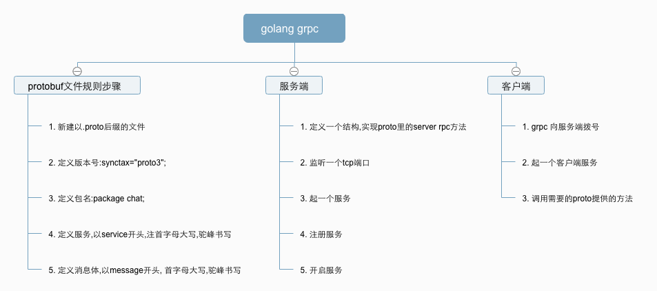

# grpc

## grpc 流程图

## 多种实现
1. [golang gRPC 简单实现服务端与客户端](https://github.com/yezihack/grpc/tree/master/go-grpc-simple)
1. [golang gRPC流 实现服务端与客户端](https://github.com/yezihack/grpc/tree/master/go-grpc-simple-stream)
1. [PHP调用GRPC的any, map类型方法](https://github.com/yezihack/grpc/tree/master/grpc-any-map)
